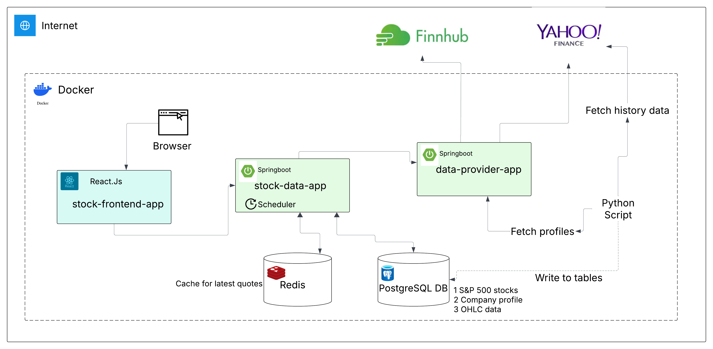
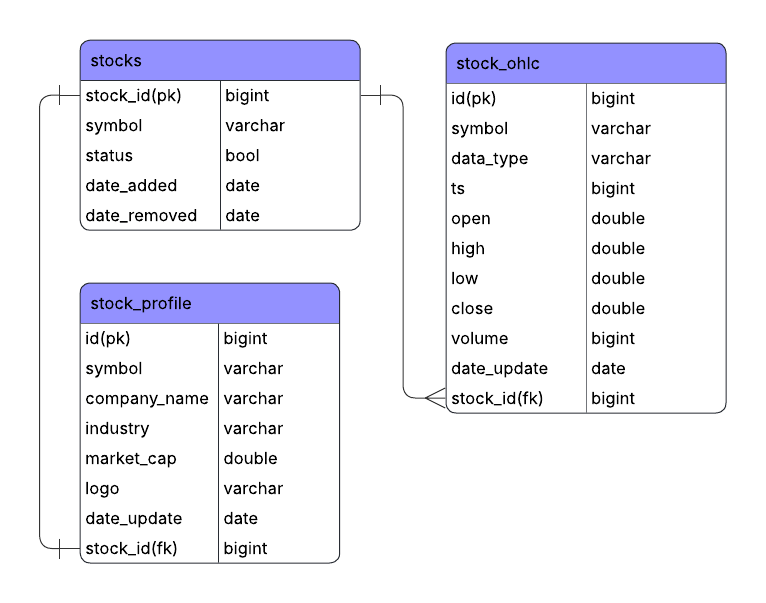
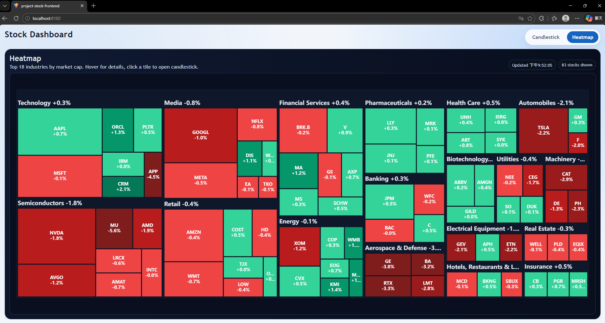
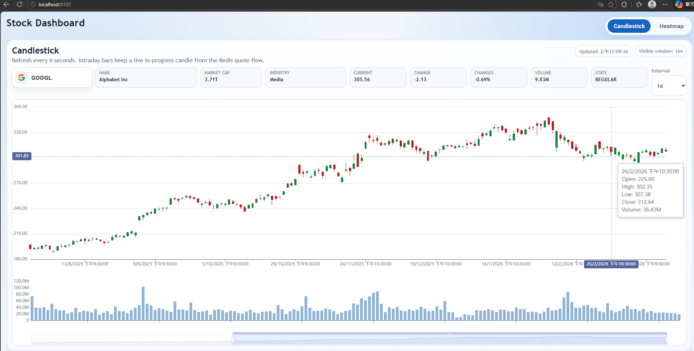

# Final Project - Stock Dashboard

## Overview
This project is a stock dashboard system that provides candlestick charts, heatmap visualization, symbol search, and company profile data. The backend is built with Spring Boot REST APIs, the frontend uses React and ECharts, and Python scripts are used for historical data backfill and preprocessing. Redis is used for latest quote caching, while PostgreSQL stores stock master data, profiles, and OHLC history.

## Features
- Interactive candlestick chart with multiple intervals
- Heatmap by industry and market cap
- RESTful API
- Python scripts for historical OHLC and company profile backfill
- PostgreSQL persistence with JPA/Hibernate entity mapping
- Docker-based multi-service deployment and Postman API validation
- Live quote refresh using AJAX polling

## System Architecture
- Spring Boot backend provides APIs
- Redis stores latest quotes for fast access
- PostgreSQL stores historical stock data and company profiles
- Python scripts backfill symbols, profiles, and OHLC data
- React.js frontend displays charts and heatmap

## Component Diagram


## ER Diagram


## Demo



- Demo video: [finalproject1.mp4](./demovideo/finalproject1.mp4)

## Data Flow
1. Scheduler pulls latest quotes from the external provider
2. Latest quotes are cached in Redis
3. Backend builds and aggregates candlestick data
4. Historical OHLC and profile data are stored in PostgreSQL
5. Frontend fetches candlestick and heatmap data from backend APIs

## Project Structure
- `project-stock-frontend/` frontend
- `project-stock-data/` backend
- `final-project-python/` backfill scripts

## Setup / Run Steps
### Prerequisites
- Docker Desktop
- Java 17
- Maven
- Node.js and npm
- Python 3

### Build Docker Images
Run with Docker Compose:
```bash
bash docker_env_setup.sh
```


### Service Ports
- Frontend: `http://localhost:8102`
- Stock data API: `http://localhost:8101`
- Data provider API: `http://localhost:8100`
- PostgreSQL: `localhost:5532`
- Redis: `localhost:6479`


### Python Backfill Scripts
1. Create and activate the Python virtual environment:
```bash
cd final-project-python
bash setup.sh
```

2. Run symbol sync:
```bash
python get_symbols.py
```

3. Run profile backfill:
```bash
python backfill_profile.py 
```

4. Run daily history backfill:
```bash
python backfill_daily.py
```

5. Run intraday history backfill:
```bash
python backfill_intraday.py
```
